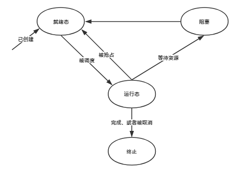

# 线程

## 建立和使用线程

### 线程标识符

程序中使用线程标识符 ID 来表示线程。线程 ID 属于封装的 pthreadLt 类型。
为建立线程，你需要在程序中声明一个 `pthread_t` 类型的变量。 如果只需在某个函数中使用线程 ID，或者函数直到线程终止时才返回，则可以将线程 ID 声明为自动存储变量，不过大部分时间内， 线程 ID 保存在共享变量中（静态或外部）， 或者保存在堆空间的结构体中。

```c
pthread_t thread;
```

### 创建线程

通过向 `pthread_create` 函数传送线程函数地址和线程函数调用的参数来创建线程。线程函数应该只有一个 `void *` 类型参数，并返回相同的类型值。
当创建线程时，`pthread_create` 函数返回一个 `pthread_t` 类型的线程 ID, 并保存在 thread 参数中。 通过这个线程 ID， 程序可以引用该线程。

```c
int pthread_create(pthread_t *thread, const pthreae_attr_t *attr, void *(*start)(void *), void *arg);
```

### 获得自己的线程ID

线程可以通过调用 `pthread_self` 来获得自身的 ID。除非线程的创建者或者线程本身将线程 ID 保存于某处，否则不可能获得一个线程的 ID。要对线程进行任何操作都必须通过线程 ID。

```c
pthread_t pthread_self(void);
```

### 比较线程

可以使用 `pthread_equal` 函数来比较两个线程 ID,只能比较二者是否相同。比较两个线程 ID 谁大谁小是没有任何意义的，因为线程 ID 之间不存在顺序。如果两个线程 ID 表示同一个线程，则 `pthread_equal` 函数返回非零值，否则返回零值。

```c
int pthread_equal(pthread_t tl, pthread_t t2);  // 相等返回非0值
```

### 分离线程

如果要创建一个从不需要控制的线程，可以是用属性（attribute）来建立线程以使它可分离的。如果不想等待创建的某个线程，而且知道不再需要控制它，可以使用 `pthread_detach` 函数来分离它。
分离一个正在运行的线程不会对线程带来任何影响，仅仅是通知系统当该线程结束时，其所属资源可以被回收。

```c
int pthread_detach(pthread_t thread);
```

### 退出线程

当 C 程序运行时，首先运行 `main` 函数。在线程代码中， 这个特殊的执行流被称为 “**初始线程**” 或 “**主线程**”。 你可以在初始线程中做任何你能在普通线程中做的事情。也可以调用 `pthread_exit` 来终止自己。

```c
int pthread_exit(void *value_ptr);
```

### 取消线程

外部发送终止信号给指定线程，如果成功则返回0，否则返回非0。发送成功并不意味着线程会终止。
另外，如果一个线程被回收，终止线程的 ID 可能被分配给其他新的线程，使用该 ID 调用 `pthread_cancel` 可能就会取消一个不同的线程， 而不是返回 ESRCH 错误。

```c
int pthread_cancel(pthread_t thread);
```

### 等待线程结束

如果需要获取线程的返回值，或者需要获知其何时结束，应该调用 `pthread_join` 函数。 `pthread_join` 函数将阻塞其调用者直到指定线程终止。然后，可以选择地保存线程的返回值。调
用 `pthread_join` 函数将自动分离指定的线程。线程会在返回时被回收，回收将释放所有在线程终止时未释放的系统和进程资源，包栝保存线程返回值的内存空间、堆栈、保存寄存器状态的内存空间等。所以，在线程终止后上述资源就不该被访问了。

```c
int pthread_join(pthread_t thread, void **value_ptr);
```

## 线程生命周期

线程有四种基本状态：

- 就绪（Ready）状态。线程能够运行，但在等待可用的处理器，可能刚刚启动，或刚刚从阻塞中恢复，或者被其他线程抢占。
- 运行（Running）状态。线程正在运行，在多处器系统中，可能有多个线程处于运行态线程由于等待处理器外的其他条件无法运行，如条件变量的改变、加锁互斥量或 I/O 操作结束。
- 阻塞（Blocked）状态。线程由于等待处理器外的其他条件无法运行，如条件变量的改变、加锁互斥量或 I/O 操作结束。
- 终止（Terminated）状态。线程从起始函数中返回，或调用 pthread_exit，或者被取消，终止自己并完成所有资源清理。不是被分离，也不是被连接，一且线程被分离或者连接，它就可以被收回。

下面是线程的状态转换图：



下面程序展示了一个线程使用的完整生命周期实例：

```c
#include <pthread.h>
#include "errors.h"

void *thread_routine(void *arg) {
    return arg;
}

int main(void) {
    pthread_t thread_id;
    void *thread_result;
    int status;

    status = pthread_create(&thread_id, NULL, thread_routine, NULL);
    if (status != 0)
        err_abort(status, "Create thread");

    status = pthread_join(thread_id, &thread_result);
    if (status != 0)
        err_abort(status, "Join thread");

    if (thread_result == NULL)
        return 0;
    else
        return 1;
}
```

上面程序中 `pthread_create` 创建线程后，线程处于就绪状态。受调度机制的限制，新线程可能在就绪状态下停留一段时间才被执行。
当处理器选中一个就绪线程执行它时，该线程进入运行态。通常这意味着某个其他线程被阻塞或者被时间片机制抢占，处理器会保存被阻塞（或抢占）线程的环境并恢复下二个就绪线程的环境。
主线程在调用 `pthread_join` 进入阻塞状态，等待它创建的线程运行结束。
当调用 `pthread_exit` 退出线程或调用 `pthread_cancel` 取消线程时， 线程在调用完清理过程后也将进入终止态。而主线程等到创建的线程终止后重新运行直到结束。