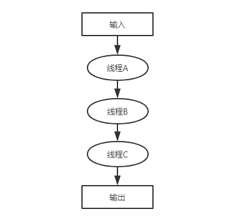
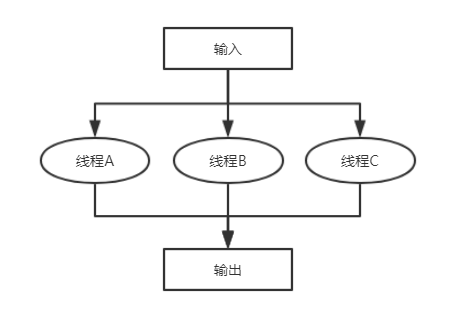
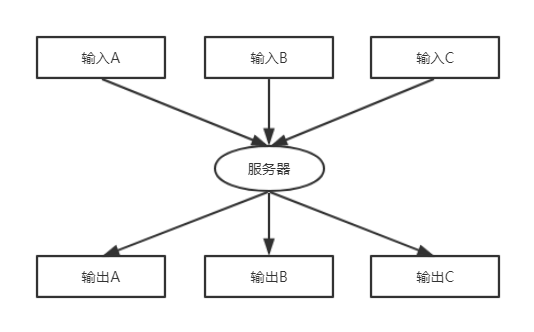

# 使用线程的几种方式

## 线程编程模型

线程变成模型主要有以下3种：

- 流水线。每个线程反复地在数据系列集上执行冋一种操作，并把操作结果传递给下一步驟的其他线程。
- 工作组。每个线程在自己的数据上执行操作，工作组中的线程可能执行同样的操作，也可能执行不同的操作，但是它们一定独立地执行。
- 客户端/服务器。一个客户为每一件工作与一个独立的服务器“订契约”。通常“订契约"是匿名的，即一个请求通过某种接提交。

## 流水线

在流水线（pipeline) 方式中，“数据元素”流串行地被一组线程顺序处理。每个线程依次在每个元素上执行一个特定的操作，并将结果传递给流
水线中的下一个线程。

例如， 数据可能是扫描的图像，线程 A 可能处理一个图像数组，线程 B 可能在处理的数据中搜索某个特定的属性集，而线程 C 可能控制从线程 B 中收集连续的搜索结果流井做出报告。或者每个线程可能执行某个数据修改序列中的一步。

## 工作组

在工作组模式中，数据由一组线程分别独立地处理。循环的“并行分解” 通常就是属于这种模式。

例如，可能建立一组线程，每个线程负责处理数组的某些行或列。单一数据集合在线程间分离成不同部分，且结果是一个数据集。
由于所有的工作线程在不同的数据部分上执行相同的操作，这种模式通常被称为 SIMD (single instruction, multiple data, 单指令多数据流）并行处理。

## 客户/服务器

在客户服务器系统中，客户请求服务器对一组数据执行某个操作。服务器独立地执行操作——客户端或者等待服务器执行，或者并行地执行并在后面需要时査找结果。尽管让客户等待是最简单的，但这种方式很少有用，因为它不会为客户带来性能上的提高。另一方面，这又是一种对某些公共资源同步管理的简单方式。

